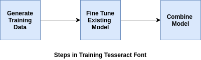
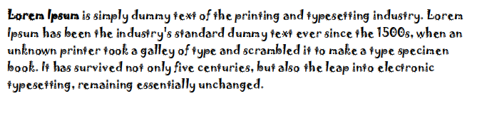
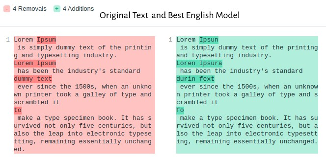
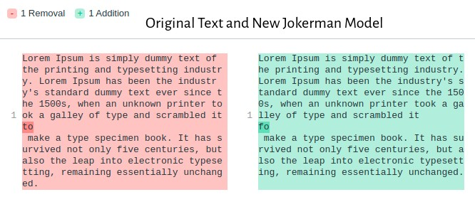

# Custom Font Training in Tesseract

Tesseract is an optical character recognition engine for various operating systems. In this article, we will be discussing the steps that I have followed in training a model for the [`Jokerman`](https://fontzone.net/font-details/jokerman) font. All the code that I have used is available in [`nikhilbaby/tesseract-training`](https://github.com/nikhilbaby/tesseract-training).

I have used an AWS EC2(t2.large) instance running Ubuntu 18 for the training process. Before proceeding with the training steps, it is mandatory to have installed the latest version of the tesseract from the source and the dependencies. You can use [`install_tesseract.sh`](https://github.com/nikhilbaby/tesseract-training/blob/master/install_tesseract.sh) for making the installation faster in a Ubuntu machine.

## Training Tesseract
For training tesseract, you will have to add download the [`langdata_lstm`](https://github.com/tesseract-ocr/langdata_lstm) from the official repository and add it to the tesseract root directory. You will also have to download the best [`eng.traineddata`](https://github.com/tesseract-ocr/tessdata_best/blob/main/eng.traineddata) and add it to tesseract/tessdata. The font has to be placed in the /fonts directory.

The training process has 3 main stages as shown in the diagram below:




## Generating Training Data

The first step in the training process is to generate the training data. In our case, we will use `tesstrain.sh` script provided by tesseract to generate the training data.
```console
$ tesstrain.sh --fonts_dir fonts 
    --fontlist "Jokerman Regular" 
    --lang eng 
    --linedata_only 
    --langdata_dir ./tesseract/langdata_lstm 
    --tessdata_dir ./tesseract/tessdata  
    --maxpages 10 
    --output_dir train
```
The above code will create training data and add it to the /train folder. The name of the font is passed in the fontlist parameter. maxpages defines the number of pages of data generated.

## Fine Tuning Tuning Existing Model

We are training a model that can detect Jokerman font. So we could take the best English model and fine-tune it to fit the font. Extract the model from [`eng.traineddata`](https://github.com/tesseract-ocr/tessdata_best/blob/main/eng.traineddata) and use it to fine-tune the font.

```console
$ combine_tessdata -e ./tesseract/tessdata/eng.traineddata eng.lstm


OMP_THREAD_LIMIT=8 lstmtraining 
    --continue_from eng.lstm 
    --model_output output/jokerman 
    --traineddata tesseract/tessdata/eng.traineddata
    --train_listfile ./train/eng.training_files.txt
    --max_iterations 400
```

## Combine Model

Once the fine-tuned model is obtained, combine the generated checkpoints with the best English model to get the final jokerman.trainneddata

```console
lstmtraining --stop_training
             --continue_from output/jokerman_checkpoint
             --traineddata ./tesseract/tessdata/eng.traineddata
             --model_output output/jokerman.traineddata
```
All the commands used for the training are available in training.sh.

## Performance Evaluation
I was able to get an accuracy of 99.4 with 10 pages and 400 iterations. The performance can be further improved by increasing the number of pages and iterations.


The image shown above was used with the best English Model and the Jokerman model that we trained. It can be clearly seen from the results that there is a lot of performance improvement with the new model.




## References
1. [https://github.com/tesseract-ocr/](https://github.com/tesseract-ocr/)
2. [https://github.com/tesseract-ocr/tesseract/wiki/TrainingTesseract-4.00](https://github.com/tesseract-ocr/tesseract/wiki/TrainingTesseract-4.00)
3. [https://stackoverflow.com/questions/41295527/tesseract-training-for-a-new-font](https://stackoverflow.com/questions/41295527/tesseract-training-for-a-new-font)
4. [https://www.linkedin.com/pulse/custom-font-training-tesseract-nikhil-baby/](https://www.linkedin.com/pulse/custom-font-training-tesseract-nikhil-baby/)
